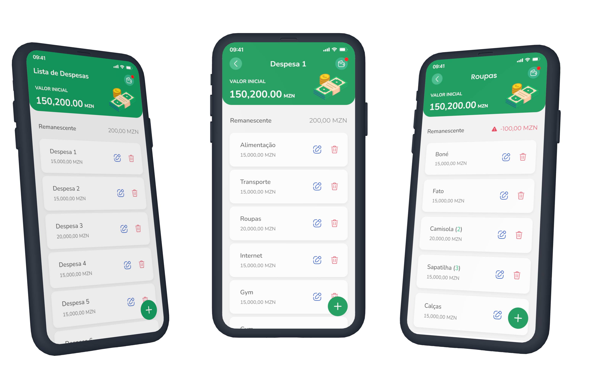

# Mettical

> An app to track expenses and their respective costs, built using [React](https://react.dev/) + [Tailwind CSS](https://tailwindcss.com/) + [Capacitor](https://capacitorjs.com/solution/react).



## Getting Started

Before running the app, make sure you have Node.js and npm (Node Package Manager) installed on your machine and then clone this repository.

Execute the following commands in order to install the dependecies

```bash
npm install
```

# Running Mettical

After installing the dependencies, you can run the Mettical app with the following command:

```bash
npm run dev
```

# Contributing

If you would like to contribute to the development of Mettical, feel free to fork this repository and submit your suggestions through pull requests. Your help is always appreciated!

# Support

If you have any questions, issues, or suggestions related to Mettical, feel free to open an issue in this repository. We will do our best to assist and resolve any concerns.

# Legal Disclaimer

Mettical is an open-source and free project, provided without any warranty. Use it at your own risk. Please check the licenses of all dependencies before using this app in production.

# License

This app is licensed under the [MIT License](https://opensource.org/license/mit/). Feel free to use, modify, and distribute Mettical according to the terms of the license.
